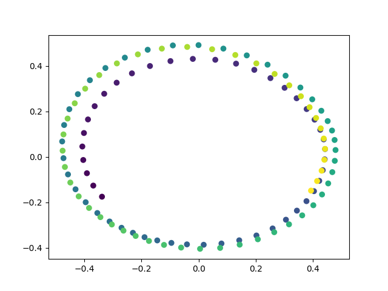
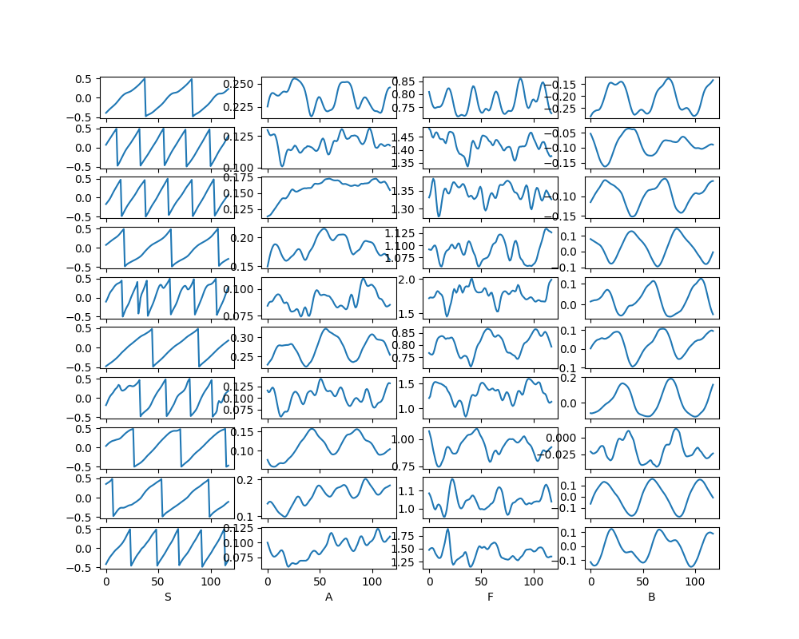

- # RSMT Model README

  Welcome to the official repository for the paper "RSMT: Real-time Stylized Motion Transition for Characters". This repository's code framework is similar to the paper "Real-time Controllable Motion Transition for Characters," which is a state-of-the-art method in the field of real-time and offline transition motion generation. If you wish to reproduce the paper, you can start from this repository.

  ## Overview

  Our RSMT model is based on the 100STYLE dataset with the phase, which can be obtained by the trained phase manifold. You can download the 100STYLE dataset from https://www.ianxmason.com/100style/. The downloaded file should be set in `MotionData/100STYLE`. Before training our RSMT model, we show how to preprocess the 100STYLE dataset, then train the phase manifold, generate the phase vectors for all motion sequences, and lastly train the RSMT model, which consists of two components: a manifold and a sampler.

  ## Dataset Preprocessing

  To use the pre-trained 100STYLE dataset, first, download the 100STYLE folder and save it in `./MotionData/100STYLE`. Next, preprocess the 100STYLE dataset by running the following command in your terminal:

  ```bash
  python process_dataset.py --preprocess
  ```

  This includes converting all `.bvh` files to binary and augmenting the dataset. Once preprocessing is complete, the 100STYLE folder should contain the following files:

  - `skeleton`
  - `test_binary.dat`, `test_binary_agument.dat`
  - `train_binary.dat`, `train_binary_agument.dat`

  ## Train Phase Model

  To train the phase manifold, construct the dataset by running the following command:

  ```bash
  python process_dataset.py --train_phase_model
  ```

  Then train `deepphase` by running this command:

  ```bash
  python train_deephase.py
  ```

  The main part of the phase model comes from https://github.com/sebastianstarke/AI4Animation. We accelerated it by parallelly calculating Eq. 4 ($(s_x,s_y) = FC(L_i)$) of the paper “DeepPhase: Periodic Autoencoders for Learning Motion Phase Manifolds”.

  After training, run the following code to validate:

  ```bash
  python train_deephase.py --test --version YOUR_VERSION --epoch YOUR_EPOCH
  ```

  This will plot two figures: 

   

  

  ## Generate Phase Vectors for the Dataset

  To generate the phase vectors for the dataset, run the following command in your terminal:

  ```bash
  python process_dataset.py --add_phase_to_dataset --model_path "YOUR_PHASE_MODEL_PATH"
  ```

  ## Train Manifold

  Before training the manifold, split the motion sequences into windows of 60 frames by running the following command:

  ```bash
  python process_dataset.py --train_manifold_model
  ```

  After processing the dataset, train the model with the following command:

  ```bash
  python train_styleVAE.py 
  ```

  Once training is complete, you can validate it by running:

  ```bash
  python train_styleVAE.py --test --version YOUR_VERSION --epoch YOUR_EPOCH
  ```

  It generates multiple `.bvh` files, among which `test_net.bvh` is generated by the trained model. This process removes part of the training information from the model and saves the model as `m_save_model_YOUR_EPOCH`.

  ## Train Sampler

  First, prepare the dataset for style sequences by running the following command (Note: style sequences contain 120 frames per sequence, unlike the manifold which contains 60 frames per sequence):

  ```bash
  python process_dataset.py --train_sampler_model
  ```

  Then train the sampler:

  ```bash
  python train_transitionNet.py --moe_model YOUR_MANIFOLD_MODEL
  ```

  After training, you can validate the model by running:

  ```bash
  python train_trainsitionNet.py --test --moe_model YOUR_MANIFOLD_MODEL --version YOUR_VERSION --epoch YOUR_EPOCH
  ```

  The output result is `test_net.bvh`.

  Note: The model only supports sequences that have the phase vector at the first key frame.

  ### Generate Longer Sequences between Multiple Key-frames

  For more information on generating longer sequences between multiple key-frames, refer to the `Running_LongSeq.py` file.

  ### Benchmarks

  To prepare the test dataset for benchmarks, run:

  ```bash
  python process_dataset.py --benchmarks
  ```

  Then run benchmarks with:

  ```bash
  python benchmarks.py --model_path 
  ```

  ### General Applications

  To use this method on key frames without a corresponding phase vector, a possible way is to predict the phase vector for the first frame, given by the past frames. 

  After training all other components, train the phase predictor with the following command:

  ```bash
  python train_transitionNet.py --predict_phase --pretrained --version YOUR_VERSION --epoch YOUR_EPOCH
  ```

  If you use this code in any context, please cite the following paper: **insert paper citation**.